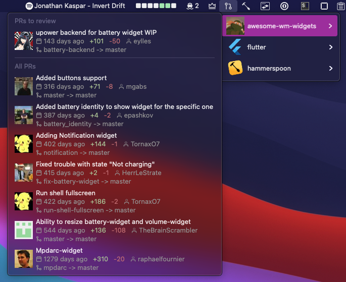

# GitHub Repo Pull Requests

A menu bar app, showing a list of pull requests for multiple repositories:



# Installation

 - install [Hammerspoon](http://www.hammerspoon.org/) - a powerfull automation tool for OS X
   - Manually:

      Download the [latest release](https://github.com/Hammerspoon/hammerspoon/releases/latest), and drag Hammerspoon.app from your Downloads folder to Applications.
   - Homebrew:

      ```brew install hammerspoon --cask```

 - download [github-repo-pull-requests.spoon](https://github.com/fork-my-spoons/github-repo-pull-requests.spoon/releases/latest/download/github-repo-pull-requests.spoon.zip), unzip and double click on a .spoon file. It will be installed under `~/.hammerspoon/Spoons` folder.
 
 - install `gh` - [GitHub CLI](https://cli.github.com/)

 - open ~/.hammerspoon/init.lua and add the following snippet, with your repositories:

```lua
-- github repo pull requests
hs.loadSpoon("github-repo-pull-requests")
spoon['github-repo-pull-requests']:setup({
  repos = {
    'streetturtle/awesome-wm-widgets',
    'hammerspoon/hammerspoon',
    'flutter/flutter'
  }
})
spoon['github-repo-pull-requests']:start()
```


This app uses icons, to properly display them, install a [feather-font](https://github.com/AT-UI/feather-font) by [downloading](https://github.com/AT-UI/feather-font/raw/master/src/fonts/feather.ttf) the .ttf font and installing it.